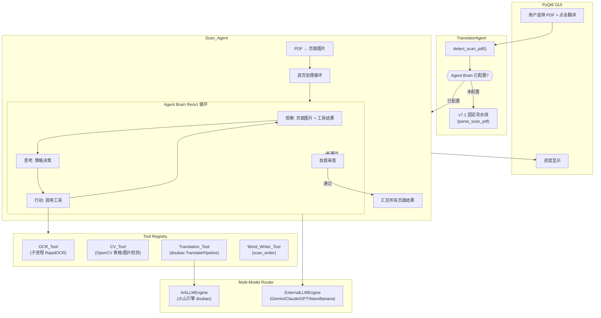
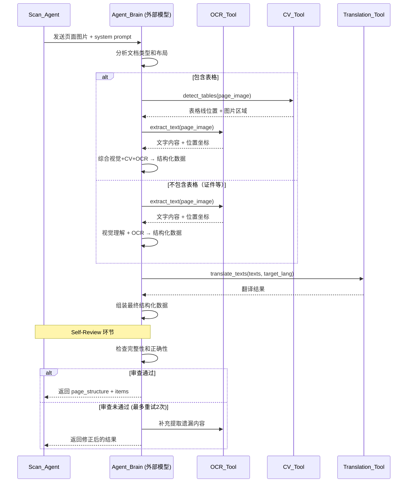

# 技术设计文档：扫描件 Agent 架构

## 概述

本设计将扫描件 PDF 翻译从固定流水线（v7.1: OpenCV → RapidOCR → Vision LLM → Word）重构为 Agent 架构。核心思路：

1. **Agent 大脑**（Gemini/Claude/GPT）看到文档图片后自主决策处理策略
2. **工具注册表**将 OCR、CV 检测、翻译、Word 生成封装为可调用工具
3. **ReAct 循环**：观察 → 思考 → 行动 → 观察结果 → 继续，直到完成
4. **自我审查**：完成后 Agent 检查输出质量，必要时重新调用工具补充

> 📘 教学笔记：为什么要从固定流水线升级到 Agent？
>
> v7.1 的流水线是"写死的"：每页都走 CV → OCR → Vision LLM，不管文档是什么类型。
> 出生证不需要表格检测，但流水线还是会跑 CV；纯文本文档不需要复杂结构分析，但流水线还是会调 Vision LLM。
>
> Agent 架构的核心优势是**自适应**：大脑看到图片后自己决定该调什么工具、按什么顺序。
> 新文档类型不需要改代码，只需要 Agent 大脑"看懂"就行。

### 重构范围

- **仅重构扫描件 PDF 翻译**（`is_scan=True` 时触发）
- Word (.docx)、PPT (.pptx)、普通 PDF（有文本层）的翻译流程完全不动
- 火山引擎 API（doubao 模型）继续用于翻译，Agent 大脑是额外加的外部模型，两套并存

### 设计约束

- RapidOCR 必须在子进程中运行（PyQt6 + onnxruntime DLL 冲突）
- scan_writer.py 已有完善的 Word 生成能力，Agent 只需产出兼容的结构化数据
- 外部模型未配置时必须回退到 v7.1 流水线
- 使用 `openai` Python 包调用外部模型（Gemini/Claude/GPT/NanoBanana 均支持 OpenAI 兼容协议）

## 架构

### 整体架构图



### Agent 处理流程（单页）




## 组件与接口

### 1. ExternalLLMEngine（外部模型引擎）

> 📘 教学笔记：为什么用 `openai` 包而不是各家 SDK？
>
> Gemini、Claude、GPT 三家都支持 OpenAI 兼容协议。用一个 `openai` 包 + 不同的 `base_url` 就能调用所有三家。
> 这样只需要维护一套代码，而不是三套 SDK。

**文件位置**: `core/external_llm_engine.py`

**类定义**:
```python
class ExternalLLMEngine:
    """
    基于 openai 包的外部模型引擎，兼容 Gemini/Claude/GPT。
    与 ArkLLMEngine 保持相同的输出格式（stream_chat yield dict）。
    """
    def __init__(
        self,
        api_key: str,
        model_id: str,
        base_url: str,              # 不同提供商的 API 地址
        max_retries: int = 3,
        retry_base_delay: float = 1.0,
    ): ...

    def stream_chat(
        self,
        messages: List[Dict],
        tools: List[Dict] = None,
    ) -> Generator[Dict, None, None]:
        """
        与 ArkLLMEngine.stream_chat 完全相同的接口和输出格式。
        yield {"type": "text", "content": "..."} 
        yield {"type": "tool_call", "id": "...", "name": "...", "arguments": "..."}
        yield {"type": "usage", "prompt_tokens": N, "completion_tokens": N, "total_tokens": N}
        """
        ...
```

**提供商配置映射**:
```python
PROVIDER_CONFIG = {
    "gemini": {
        "base_url": "https://generativelanguage.googleapis.com/v1beta/openai/",
        "env_key": "GEMINI_API_KEY",
    },
    "claude": {
        "base_url": "https://api.anthropic.com/v1/",
        "env_key": "CLAUDE_API_KEY",
    },
    "openai": {
        "base_url": "https://api.openai.com/v1/",
        "env_key": "OPENAI_API_KEY",
    },
    "nanobanana": {
        "base_url": "https://api.nanobanana.com/v1/",
        "env_key": "NANOBANANA_API_KEY",
    },
}
```

> 📘 教学笔记：NanoBanana Pro 也兼容 OpenAI 协议，所以和 Gemini/Claude/GPT 一样，
> 只需要配置不同的 base_url 和 API key 就能接入。

**关键设计决策**:
- `stream_chat` 的输出格式与 `ArkLLMEngine` 完全一致，使得 `BaseAgent` 和 `LLMRouter` 无需修改
- 重试机制复用 `ArkLLMEngine` 的相同逻辑（指数退避 + 可重试错误判断）
- 图片通过 messages 中的 `image_url` 类型传递（base64 编码），这是 OpenAI 协议标准

### 2. MultiModelRouter（扩展后的模型路由器）

**文件位置**: `core/llm_router.py`（扩展现有 LLMRouter）

**扩展方案**: 在现有 `LLMRouter` 基础上增加 `register_external` 方法：

```python
class LLMRouter:
    # ... 现有代码不变 ...

    def register_external(
        self,
        name: str,
        provider: str,       # "gemini" / "claude" / "openai" / "nanobanana"
        model_id: str,
        api_key: str = None,  # None 时从 .env 自动读取
        max_retries: int = 3,
    ) -> "LLMRouter":
        """注册一个外部模型引擎"""
        ...
```

> 📘 教学笔记：为什么扩展 LLMRouter 而不是新建？
>
> `LLMRouter.get()` 返回的引擎只要有 `stream_chat` 方法就行。
> `ExternalLLMEngine` 和 `ArkLLMEngine` 都有这个方法，所以 Router 不关心引擎类型。
> 这就是"鸭子类型"（Duck Typing）：只要叫起来像鸭子，就是鸭子。

### 3. Tool Registry（工具注册表）

**文件位置**: `tools/scan_tools.py`

所有工具继承现有 `BaseTool`，实现 `execute(params) -> str` 接口。

#### 3.1 OCR_Tool

```python
class OCRTool(BaseTool):
    name = "ocr_extract_text"
    description = "对页面图片执行 OCR 文字识别，返回所有文字内容及其位置坐标。在子进程中运行以避免 DLL 冲突。"
    parameters = {
        "type": "object",
        "properties": {
            "page_index": {"type": "integer", "description": "页码索引（从0开始）"}
        },
        "required": ["page_index"]
    }
```

- 内部调用 `_ocr_page_subprocess()`（复用 scan_parser.py 中的子进程 OCR）
- 返回 JSON 字符串：`[{"text": "...", "bbox": [x1,y1,x2,y2], "confidence": 0.95}, ...]`
- 页面图片通过 `ScanAgent` 上下文传入（不通过参数，避免 base64 在 JSON 中传递）

#### 3.2 CV_Tool

```python
class CVTool(BaseTool):
    name = "cv_detect_layout"
    description = "使用 OpenCV 检测页面中的表格线（水平线和垂直线）和图片区域，返回结构化的位置信息。"
    parameters = {
        "type": "object",
        "properties": {
            "page_index": {"type": "integer", "description": "页码索引（从0开始）"}
        },
        "required": ["page_index"]
    }
```

- 内部调用 `_detect_table_lines()` 和 `_detect_image_regions()`
- 返回 JSON：`{"has_table": true, "h_lines": [...], "v_lines": [...], "image_regions": [...]}`

#### 3.3 Translation_Tool

```python
class TranslationTool(BaseTool):
    name = "translate_texts"
    description = "将一批文本翻译为目标语言。使用 doubao 模型进行高质量翻译。"
    parameters = {
        "type": "object",
        "properties": {
            "texts": {
                "type": "array",
                "items": {"type": "string"},
                "description": "待翻译的文本列表"
            },
            "target_lang": {"type": "string", "description": "目标语言，如'英文'、'日文'"}
        },
        "required": ["texts", "target_lang"]
    }
```

- 内部调用 `TranslatePipeline.translate_batch()`
- 返回 JSON：`{"translations": {"原文1": "译文1", "原文2": "译文2"}}`

#### 3.4 Word_Writer_Tool

```python
class WordWriterTool(BaseTool):
    name = "generate_word_document"
    description = "根据结构化数据和翻译结果生成 Word 文档。"
    parameters = {
        "type": "object",
        "properties": {
            "page_structures": {"type": "array", "description": "每页的结构化数据"},
            "translations": {"type": "object", "description": "翻译映射 {key: 译文}"},
            "output_path": {"type": "string", "description": "输出文件路径"}
        },
        "required": ["page_structures", "translations", "output_path"]
    }
```

- 内部调用 `write_scan_pdf()`
- 返回生成的文件路径

> 📘 教学笔记：工具设计的关键原则
>
> 1. **页面图片不通过工具参数传递** — base64 图片太大，放在 JSON 参数里会浪费 token。
>    OCR_Tool 和 CV_Tool 通过 `ScanAgent` 的上下文（`self.page_images`）直接访问图片。
> 2. **工具返回 JSON 字符串** — LLM 能直接理解 JSON，不需要额外解析。
> 3. **翻译工具用 doubao** — Agent 大脑（Gemini/Claude）负责理解和决策，翻译还是用 doubao（便宜且质量好）。

### 4. ScanAgent（扫描件翻译 Agent）

**文件位置**: `translator/scan_agent.py`

```python
class ScanAgent:
    """
    扫描件翻译 Agent。
    
    职责：
    1. 将 PDF 渲染为页面图片
    2. 逐页调用 Agent Brain 处理（ReAct 循环）
    3. 汇总结果，调用 Word Writer 生成文档
    4. 通过事件机制报告进度
    """
    def __init__(
        self,
        brain_engine,           # ExternalLLMEngine 实例（Agent 大脑）
        translate_pipeline,     # TranslatePipeline 实例（翻译用）
        format_engine,          # FormatEngine 实例（Word 格式用）
        max_tool_calls: int = 10,   # 单页最大工具调用次数
        max_review_retries: int = 2, # 自我审查最大重试次数
    ): ...

    def process_scan_pdf(
        self,
        filepath: str,
        output_path: str,
        target_lang: str = "英文",
        on_event: Callable[[AgentEvent], None] = None,
    ) -> Dict[str, Any]:
        """
        端到端处理扫描件 PDF。
        
        返回与 parse_scan_pdf 兼容的数据格式：
        {
            "source": "scan_agent",
            "source_type": "scan",
            "filepath": filepath,
            "items": [...],
            "page_structures": [...],
            "page_images": [...],
        }
        """
        ...

    def _process_single_page(
        self,
        page_idx: int,
        page_image_b64: str,
        target_lang: str,
    ) -> Tuple[dict, List[dict]]:
        """
        用 Agent Brain 处理单页。
        
        实现 ReAct 循环：
        1. 发送页面图片 + system prompt 给 Brain
        2. Brain 返回工具调用 → 执行工具 → 将结果反馈给 Brain
        3. Brain 返回最终结构化数据 → 结束
        """
        ...

    def _self_review(
        self,
        page_idx: int,
        page_image_b64: str,
        page_structure: dict,
        items: list,
    ) -> Tuple[bool, str]:
        """
        自我审查：检查结构提取和翻译的完整性。
        
        返回 (passed: bool, reason: str)
        """
        ...
```

**与现有系统的集成点**:

`TranslatorAgent.translate_file()` 中的修改：

```python
# 现有代码
if is_scan:
    parsed_data = parse_scan_pdf(input_path, vision_llm=vision_engine)

# 修改为
if is_scan:
    if self._has_agent_brain():
        # Agent 模式：端到端处理（含翻译）
        scan_agent = ScanAgent(
            brain_engine=self.router.get("agent_brain"),
            translate_pipeline=self.pipeline,
            format_engine=self.format_engine,
        )
        result = scan_agent.process_scan_pdf(
            filepath=input_path,
            output_path=output_path,
            target_lang=target_lang,
        )
        return result["output_path"]
    else:
        # 回退到 v7.1 固定流水线
        parsed_data = parse_scan_pdf(input_path, vision_llm=vision_engine)
```

### 5. 配置扩展

**文件位置**: `config/settings.py`（扩展现有 Config 类）

新增 `.env` 配置项：
```env
# Agent Brain 配置
AGENT_BRAIN_PROVIDER=gemini          # gemini / claude / openai / nanobanana
AGENT_BRAIN_MODEL=gemini-2.5-pro     # 模型名称
AGENT_BRAIN_API_KEY=your-api-key     # API 密钥（如果和下面的 provider 专用 key 重复，优先用这个）

# 各 Provider 专用 API Key（可选，AGENT_BRAIN_API_KEY 优先）
GEMINI_API_KEY=
CLAUDE_API_KEY=
OPENAI_API_KEY=
NANOBANANA_API_KEY=

# Agent Brain 参数（可选）
AGENT_BRAIN_MAX_TOKENS=8192          # 最大输出 token
AGENT_BRAIN_TEMPERATURE=0.1          # 温度（低温 = 更确定性）
AGENT_BRAIN_MAX_RETRIES=3            # 最大重试次数
```

Config 类新增方法：
```python
class Config:
    # ... 现有代码 ...

    @staticmethod
    def get_agent_brain_config() -> Optional[dict]:
        """
        读取 Agent Brain 配置。未配置时返回 None。
        
        返回: {
            "provider": "gemini",
            "model": "gemini-2.5-pro",
            "api_key": "xxx",
            "max_tokens": 8192,
            "temperature": 0.1,
            "max_retries": 3,
        }
        """
        provider = os.getenv("AGENT_BRAIN_PROVIDER", "").strip()
        if not provider:
            return None
        ...
```

## 数据模型

### Agent Brain 输出的结构化数据格式

Agent Brain 必须输出与现有 `scan_writer.py` 兼容的 `page_structure` 格式。这是 Agent 和 Word Writer 之间的契约。

```python
# 单页结构（page_structure）
{
    "page_type": "table_document" | "certificate" | "text_document" | "mixed",
    "elements": [
        # 表格元素
        {
            "type": "table",
            "col_widths_pct": [30, 40, 30],  # 列宽百分比
            "rows": [
                {
                    "cells": [
                        {
                            "text": "原文内容",
                            "merge_right": 0,    # 向右合并的列数
                            "merge_down": 0,     # 向下合并的行数
                            "bold": False,
                            "align": "center",   # left/center/right
                            "vertical_text": False,
                            "borders": {         # 每条边框独立控制
                                "top": True,
                                "bottom": True,
                                "left": True,
                                "right": True
                            },
                            "image_data": None   # 单元格内图片（bytes）
                        }
                    ]
                }
            ]
        },
        # 段落元素
        {
            "type": "paragraph",
            "text": "原文内容",
            "bold": False,
            "align": "left",
            "font_size": "normal"  # small/normal/large/title
        },
        # 图片区域元素
        {
            "type": "image_region",
            "image_data": b"...",  # 裁剪后的图片 bytes
            "bbox_pct": [x1, y1, x2, y2]  # 位置百分比
        }
    ]
}
```

### 翻译单元（items）格式

与现有 `parse_scan_pdf` 输出的 items 格式一致：

```python
# 单个翻译单元
{
    "type": "table_cell" | "paragraph",
    "text": "原文内容",
    "key": "pg0_e0_r0_c0",  # 唯一标识，用于翻译映射
    "page_index": 0,
    "element_index": 0,
    # table_cell 特有
    "row_index": 0,
    "col_index": 0,
}
```

> 📘 教学笔记：key 的命名规则
>
> `pg{页码}_e{元素索引}_r{行}_c{列}` — 表格单元格
> `pg{页码}_e{元素索引}_para` — 段落
>
> 这个 key 是 scan_writer 查找翻译结果的唯一标识。
> Agent Brain 必须按这个规则生成 key，否则 Word Writer 找不到对应的翻译。

### process_scan_pdf 返回值格式

```python
{
    "source": "scan_agent",       # 标识来源为 Agent（vs "scan_parser"）
    "source_type": "scan",
    "filepath": "input.pdf",
    "output_path": "output.docx", # Agent 模式直接返回输出路径
    "items": [...],               # 所有页面的翻译单元
    "page_structures": [...],     # 每页的结构化数据
    "page_images": [...],         # 每页的原始图片 bytes
    "stats": {                    # Agent 模式特有的统计信息
        "total_time_seconds": 45.2,
        "brain_tokens": {"prompt": 12000, "completion": 3000},
        "translate_tokens": {"prompt": 5000, "completion": 2000},
        "tool_calls": {"ocr": 3, "cv": 2, "translate": 3, "word_writer": 1},
        "review_results": [
            {"page": 0, "passed": True, "reason": ""},
            {"page": 1, "passed": False, "reason": "第3行第2列文字遗漏", "retries": 2},
        ]
    }
}
```

### Agent Brain System Prompt 结构

```python
SCAN_AGENT_SYSTEM_PROMPT = """
你是一个专业的文档分析和翻译 Agent。你的任务是分析扫描件文档图片，
提取结构化内容，并完成翻译。

## 你的能力
你可以调用以下工具：
- ocr_extract_text: OCR 文字识别
- cv_detect_layout: 表格线和图片区域检测
- translate_texts: 文本翻译

## 工作流程
1. 观察页面图片，判断文档类型（表格文档/证件/纯文本等）
2. 根据文档类型决定调用哪些工具
3. 综合工具结果和视觉理解，生成结构化数据
4. 调用翻译工具翻译所有文本
5. 输出最终的 JSON 结构化数据

## 输出格式
最终输出必须是严格的 JSON，格式如下：
{page_structure 的 JSON schema}

## 重要规则
- 表格的行列数必须与原文完全一致
- 不要遗漏任何文字内容
- 图片区域标记位置即可，不需要识别图片内容
- key 命名规则：pg{页码}_e{元素索引}_r{行}_c{列} 或 pg{页码}_e{元素索引}_para
"""
```

## 正确性属性（Correctness Properties）

*正确性属性是系统在所有合法执行中都应保持为真的特征或行为——本质上是对系统行为的形式化陈述。属性是人类可读规格说明和机器可验证正确性保证之间的桥梁。*

### Property 1: stream_chat 输出格式兼容性

*For any* ExternalLLMEngine 实例和任意合法的 messages 输入，`stream_chat` 产出的每个 chunk 必须是以下三种格式之一：
- `{"type": "text", "content": str}`
- `{"type": "tool_call", "id": str, "name": str, "arguments": str}`
- `{"type": "usage", "prompt_tokens": int, "completion_tokens": int, "total_tokens": int}`

且字段类型与 ArkLLMEngine 的输出完全一致。

**Validates: Requirements 1.2**

### Property 2: 图片消息格式正确性

*For any* base64 编码的图片字符串，ExternalLLMEngine 构建的 messages 中图片内容必须符合 OpenAI 协议的 `image_url` 格式，且 base64 数据在编码/传递过程中保持不变（round-trip）。

**Validates: Requirements 1.3**

### Property 3: 重试机制指数退避

*For any* 可重试错误序列（长度 ≤ max_retries），ExternalLLMEngine 的重试等待时间应满足 `delay_i = base_delay * 2^(i-1)`，且不可重试错误（如 HTTP 400）应立即抛出而不重试。

**Validates: Requirements 1.4**

### Property 4: 路由器异构引擎管理

*For any* 混合注册的 ArkLLMEngine 和 ExternalLLMEngine 实例，LLMRouter 通过别名 `get(name)` 返回的引擎实例应与注册时的实例一致，且所有引擎都具有可调用的 `stream_chat` 方法。

**Validates: Requirements 1.5**

### Property 5: 配置解析 round-trip

*For any* 合法的环境变量组合（AGENT_BRAIN_PROVIDER、AGENT_BRAIN_MODEL、AGENT_BRAIN_API_KEY、AGENT_BRAIN_MAX_TOKENS、AGENT_BRAIN_TEMPERATURE、AGENT_BRAIN_MAX_RETRIES），`Config.get_agent_brain_config()` 返回的字典中每个字段值应与对应环境变量的值一致；未设置的可选参数应使用默认值。

**Validates: Requirements 6.1, 6.2**

### Property 6: CV_Tool 输出结构完整性

*For any* 页面图片（任意尺寸的 numpy 数组），CV_Tool 的返回值必须包含 `has_table`（bool）、`h_lines`（list）、`v_lines`（list）、`image_regions`（list）四个字段，且当 `has_table` 为 True 时 `h_lines` 和 `v_lines` 均非空。

**Validates: Requirements 2.3**

### Property 7: 工具执行安全性

*For any* 工具和任意参数字典，若缺少 required 字段则返回参数校验错误；若工具执行抛出异常则返回包含错误类型和描述的结构化错误信息（而非未捕获异常）。

**Validates: Requirements 2.6, 2.7**

### Property 8: Word 生成 round-trip

*For any* 合法的 page_structures 和 translations 字典，Word_Writer_Tool 生成的 .docx 文件应存在且可被 python-docx 正常打开，文件中的表格数量应与 page_structures 中 type="table" 的元素数量一致。

**Validates: Requirements 2.5**

### Property 9: PDF 页面渲染完整性

*For any* 有效的 PDF 文件（N 页），ScanAgent 渲染后的 page_images 列表长度应等于 N，且每个元素为非空的 bytes 对象。

**Validates: Requirements 3.1**

### Property 10: 工具调用次数上限

*For any* 单页处理过程，Agent Brain 的工具调用总次数不超过 `max_tool_calls`（默认 10）。达到上限时应强制结束循环并返回当前已有结果。

**Validates: Requirements 3.6**

### Property 11: 多页逐页处理

*For any* N 页的 PDF 文件，ScanAgent 应恰好调用 N 次 `_process_single_page`，且返回的 `page_structures` 列表长度等于 N。

**Validates: Requirements 3.7**

### Property 12: 自我审查必执行 + 结果记录

*For any* 页面处理完成后，stats.review_results 中应包含该页的审查记录（page、passed、reason 字段），且审查未通过时 retries 字段值 ≤ `max_review_retries`（默认 2）。

**Validates: Requirements 4.1, 4.3, 4.4, 4.5**

### Property 13: 返回值格式兼容性

*For any* ScanAgent.process_scan_pdf 的返回值，必须包含 `source`、`source_type`、`filepath`、`items`、`page_structures`、`page_images` 这些与 parse_scan_pdf 相同的顶层 key，且 `items` 中每个元素的 `key` 字段符合 `pg{N}_e{N}_r{N}_c{N}` 或 `pg{N}_e{N}_para` 的命名规则。

**Validates: Requirements 5.1**

### Property 14: 进度事件发射

*For any* 页面处理过程，ScanAgent 应通过 on_event 回调发射至少一个包含 `page_index`、`step`、`progress_pct` 字段的 AgentEvent。

**Validates: Requirements 5.3**

### Property 15: 统计信息完整性

*For any* 完成的处理过程，返回值的 stats 字典必须包含 `total_time_seconds`（float）、`brain_tokens`（含 prompt 和 completion）、`translate_tokens`（含 prompt 和 completion）、`tool_calls`（各工具调用次数）三个维度的信息。

**Validates: Requirements 5.5, 5.6**

### Property 16: 模型能力检测

*For any* 已知模型名称，Config 的能力检测应正确识别该模型是否支持视觉输入和工具调用。对于已知支持视觉的模型（如 gemini-2.5-pro、claude-sonnet-4、gpt-4o、nanobanana-pro）应返回 True。

**Validates: Requirements 6.4**

## 错误处理

### 分层错误处理策略

```
┌─────────────────────────────────────────────────┐
│ 第1层：LLM 引擎层（ExternalLLMEngine）          │
│ - 网络错误 / 限流 → 指数退避重试                  │
│ - 参数错误 → 立即抛出 LLMRetryError              │
│ - 所有重试失败 → 抛出 LLMRetryError              │
├─────────────────────────────────────────────────┤
│ 第2层：工具层（BaseTool.execute）                 │
│ - 参数校验失败 → 返回结构化错误字符串              │
│ - 执行异常 → 捕获并返回错误描述                    │
│ - OCR 子进程超时 → 返回超时错误                    │
├─────────────────────────────────────────────────┤
│ 第3层：Agent 层（ScanAgent）                      │
│ - LLMRetryError → 记录错误，回退到 v7.1           │
│ - 单页处理失败 → 标记该页，继续处理后续页面         │
│ - 工具调用超限 → 强制结束，使用已有结果             │
│ - 自我审查失败 → 最多重试2次，然后标记并继续        │
├─────────────────────────────────────────────────┤
│ 第4层：控制器层（TranslatorAgent）                │
│ - ScanAgent 异常 → 回退到 v7.1 流水线             │
│ - 通过 AgentEvent 向 GUI 报告错误                 │
└─────────────────────────────────────────────────┘
```

### 关键错误场景

| 错误场景 | 处理方式 | 用户可见行为 |
|---------|---------|------------|
| 外部 API 密钥无效 | 启动时检测，回退到 v7.1 | GUI 显示"使用基础模式" |
| 外部 API 限流 (429) | 指数退避重试 3 次 | 短暂等待后继续 |
| 外部 API 完全不可用 | 捕获异常，回退到 v7.1 | GUI 显示"回退到基础模式" |
| OCR 子进程崩溃 | 返回空结果，Agent 用视觉理解补偿 | 可能有少量文字遗漏 |
| Agent 输出非法 JSON | 重试解析，最多 2 次 | 该页标记质量问题 |
| 单页处理超时 | 强制结束，标记该页 | 该页可能不完整 |

> 📘 教学笔记：回退策略是安全网
>
> Agent 架构的最大风险是外部模型不可用。所以每个可能失败的环节都有回退方案：
> - 外部模型不可用 → 回退到 v7.1（用火山引擎 Vision 模型）
> - v7.1 也不可用 → 回退到纯 OCR 模式
> - OCR 也失败 → 返回空页面，不崩溃
>
> 这就是"优雅降级"（Graceful Degradation）：功能可以减少，但系统不能崩溃。

## 测试策略

### 双轨测试方法

本项目采用单元测试 + 属性测试（Property-Based Testing）双轨并行的测试策略。

#### 属性测试（Property-Based Testing）

- **库选择**: `hypothesis`（Python 生态最成熟的 PBT 库）
- **每个属性测试最少运行 100 次迭代**
- **每个测试必须用注释标注对应的设计属性**
- **标注格式**: `# Feature: scan-agent-architecture, Property {N}: {property_text}`
- **每个正确性属性由一个属性测试实现**

属性测试重点覆盖：
- Property 1: stream_chat 输出格式 — 生成随机 API 响应 chunk，验证格式转换
- Property 2: 图片消息格式 — 生成随机 base64 字符串，验证 round-trip
- Property 3: 重试机制 — 生成随机错误序列，验证退避时间
- Property 4: 路由器管理 — 生成随机引擎注册序列，验证 get() 返回正确实例
- Property 5: 配置解析 — 生成随机环境变量组合，验证 round-trip
- Property 6: CV_Tool 输出 — 生成随机图片，验证输出结构
- Property 7: 工具安全性 — 生成随机参数（含缺失字段），验证错误处理
- Property 8: Word 生成 — 生成随机 page_structures，验证 .docx 可打开
- Property 9-16: 其余属性按相同模式

#### 单元测试

单元测试聚焦于具体示例、边界条件和集成点：

- **ExternalLLMEngine 构造**: 各 provider 的 base_url 正确性
- **API 密钥缺失**: 未配置时的错误信息（edge-case 1.6）
- **模型能力不足警告**: 不支持视觉的模型配置时的警告（edge-case 6.5）
- **工具注册完整性**: 4 个工具全部注册且 schema 合法（example 2.1）
- **OCR 子进程隔离**: 验证 OCR 在独立进程中运行（example 2.2）
- **v7.1 回退**: Agent Brain 未配置时使用 parse_scan_pdf（example 5.4）
- **GUI 集成**: 扫描件 PDF 自动触发 ScanAgent（example 5.2）
- **多 provider 选择**: 多个 API key 配置时 provider 字段生效（example 6.3）

#### 测试文件结构

```
tests/
├── test_external_llm_engine.py    # Property 1-3 + 边界测试
├── test_llm_router_extended.py    # Property 4
├── test_config_agent_brain.py     # Property 5, 16 + 边界测试
├── test_scan_tools.py             # Property 6, 7, 8
├── test_scan_agent.py             # Property 9-15 + 集成测试
```
